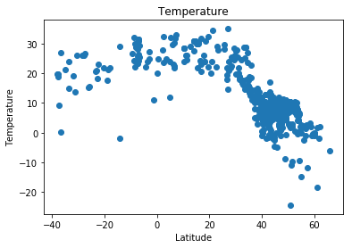
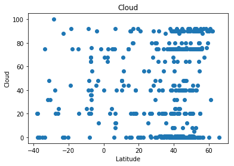
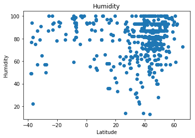

```python
import requests
import json
import random
import matplotlib.pyplot as plt

data = json.load(open('city.list.json'))

lat = []
temp = []
cloud = []
wind_speed = []
humidity = []
```


```python
for i in range(500):
    city_id = data[random.randint(0,len(data))]['id']

    res = requests.get('https://api.openweathermap.org/data/2.5/weather?id=' + str(city_id) + '&APPID=f6dfd236cf549b17c3dd3840ea52850d')
    lat.append(res.json()['coord']['lat'])
    temp.append(res.json()['main']['temp']-273.15)
    cloud.append(res.json()['clouds']['all'])
    wind_speed.append(res.json()['wind']['speed'])
    humidity.append(res.json()['main']['humidity'])
```


```python
plt.scatter(lat, temp)
plt.title('Temperature')
plt.xlabel('Latitude')
plt.ylabel('Temperature')
plt.show()
```





```python
plt.scatter(lat, cloud)
plt.title('Cloud')
plt.xlabel('Latitude')
plt.ylabel('Cloud')
plt.show()
```





```python
plt.scatter(lat, wind_speed)
plt.title('Wind Speed')
plt.xlabel('Latitude')
plt.ylabel('Wind Speed')
plt.show()
```


```python
plt.scatter(lat, humidity)
plt.title('Humidity')
plt.xlabel('Latitude')
plt.ylabel('Humidity')
plt.show()
```




